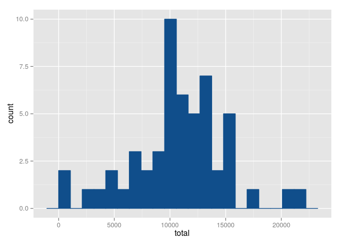
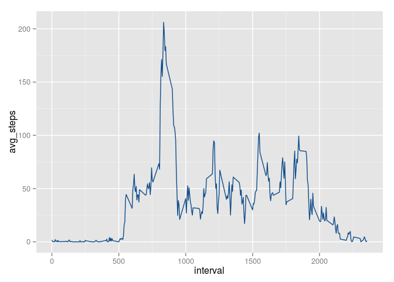
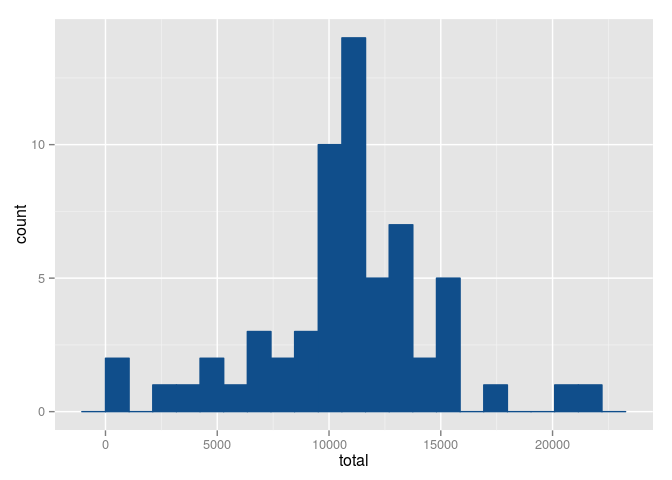
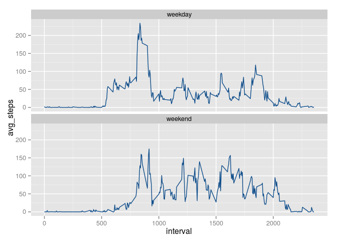

# Reproducible Research: Peer Assessment 1


## Loading and preprocessing the data

First we load some handy libraries


```
## 
## Attaching package: 'dplyr'
## 
## The following objects are masked from 'package:stats':
## 
##     filter, lag
## 
## The following objects are masked from 'package:base':
## 
##     intersect, setdiff, setequal, union
## 
## 
## Attaching package: 'data.table'
## 
## The following objects are masked from 'package:dplyr':
## 
##     between, last
```

Then we unzip the data and load it into a data.table called activities.
We convert the dates from strings to data objects and the steps to floating point numbres.


```r
setwd("~/Data-Science/RepResearch/RepData_PeerAssessment1")

unzip("activity.zip")

activity<-fread("activity.csv")
activity<-mutate(activity,
                 date=as.Date(date,"%Y-%m-%d"), 
                 steps=as.double(steps))
```

## What is mean total number of steps taken per day?

We need total count of steps by each day. To do this we group the data by day and then we get the sum of steps by day. 


```r
sum_by_date<- activity %>%
  group_by(date) %>%
  summarize(total=sum(steps))
```

1. Make a histogram of the total number of steps taken each day.


```r
rng<-range(sum_by_date$total,na.rm=TRUE)
bw<-(rng[2]-rng[1])/20
ggplot(sum_by_date,aes(x=total))+geom_histogram(binwidth=bw,color="dodgerblue4",fill="dodgerblue4")
```

 

2. Calculate and report the **mean** and **median** total number of steps taken per day


```r
summary(sum_by_date$total)[3:4]
```

```
## Median   Mean 
##  10760  10770
```

## What is the average daily activity pattern?

1. Make a time series plot (i.e. `type = "l"`) of the 5-minute interval (x-axis) and the average number of steps taken, averaged across all days (y-axis)


First we get the mean of steps by interval, then we plot it.

```r
by_interval<- activity %>%
  group_by(interval) %>%
  summarize(avg_steps=mean(steps,na.rm=TRUE))

ggplot(by_interval,aes(x=interval,y=avg_steps))+geom_line(color="dodgerblue4")
```

 

2. Which 5-minute interval, on average across all the days in the dataset, contains the maximum number of steps?

To answer this we sort and take the interval with the largest mean steps.

```r
arrange(by_interval,desc(avg_steps))[1,]
```

```
## Source: local data table [1 x 2]
## 
##   interval avg_steps
##      (int)     (dbl)
## 1      835  206.1698
```


## Imputing missing values

1. Calculate and report the total number of missing values in the dataset (i.e. the total number of rows with `NA`s)

A summary of the data will give us a count of the missing values.

```r
summary(activity)[7,1]
```

```
## [1] "NA's   :2304  "
```

2. Devise a strategy for filling in all of the missing values in the dataset. The strategy does not need to be sophisticated. For example, you could use the mean/median for that day, or the mean for that 5-minute interval, etc.

Our strategy will be: if a value is missing, we will set it to the mean of the interval.

3. Create a new dataset that is equal to the original dataset but with the missing data filled in.

If the steps of an interval is missing, we will get the mean steps of such interval from the previous section, otherwise we keep the steps as they are.


```r
activity2<-mutate(activity,
                isteps=ifelse(is.na(steps),
                              {iv<-interval
                               by_interval[interval==iv,]$avg_steps },
                              steps))
sum_by_date2<- activity2 %>%
  group_by(date) %>%
  summarize(total=sum(isteps))
```


4. Make a histogram of the total number of steps taken each day and Calculate and report the **mean** and **median** total number of steps taken per day. Do these values differ from the estimates from the first part of the assignment? What is the impact of imputing missing data on the estimates of the total daily number of steps?


```r
rng<-range(sum_by_date2$total,na.rm=TRUE)
bw<-(rng[2]-rng[1])/20
ggplot(sum_by_date2,aes(x=total))+geom_histogram(binwidth=bw,color="dodgerblue4", fill="dodgerblue4")
```

 

```r
summary(sum_by_date2$total)[3:4]
```

```
## Median   Mean 
##  10770  10770
```

We see that the mean didn't change, which is no surprise since we used the mean across all days to impute missing values. The median on the other hand inreased by 10 steps.

## Are there differences in activity patterns between weekdays and weekends?

1. Create a new factor variable in the dataset with two levels -- "weekday" and "weekend" indicating whether a given date is a weekday or weekend day.


```r
# Sorry but my  is in Spanish so:
# sábado==saturday  & domingo==sunday
weekend<-c("sábado","domingo")

activity3<-mutate(activity2,
                  nombre_dia=weekdays(date),
                  tipo_dia=as.factor(ifelse(is.element(nombre_dia,weekend),
                                  "weekend",
                                  "weekday")))
#just to check everything is fine,
with(activity3,table(nombre_dia,tipo_dia))
```

```
##            tipo_dia
## nombre_dia  weekday weekend
##   domingo         0    2304
##   jueves       2592       0
##   lunes        2592       0
##   martes       2592       0
##   miércoles    2592       0
##   sábado          0    2304
##   viernes      2592       0
```


1. Make a panel plot containing a time series plot (i.e. `type = "l"`) of the 5-minute interval (x-axis) and the average number of steps taken, averaged across all weekday days or weekend days (y-axis). The plot should look something like the follow


First we need to get the average grouped by weekend/weekday and interval, then we can proceed to get the panel plot.
 
